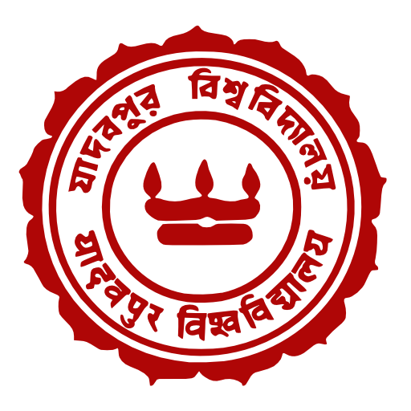

  <a class="active" href="index.html">Home</a>
  <a href="res_pub_conf.html">Research</a>
  <a href="teaching.html">Teaching</a>
  <a href="misc.html">Misc.</a>

 

> 
 
 "I have no special talent. I am only passionately curious." - Albert Einstein 
 

I am a Ph.D scholar at the [Department of Applied Mechanics and Biomedical Engineering](https://apm.iitm.ac.in/home), Indian Institute of Technology Madras IIT-M), Chennai. I worked with [Dr. Sayan Gupta](https://home.iitm.ac.in/sayan/). My interests are in the area of *nonlinear dynamics* and *stochastic processes*. I am also quite interested in modelling and system identification of *climate dynamics*.

I am from [Kolkata](https://en.wikipedia.org/wiki/Kolkata_West_Bengal), West Bengal. 
Apart from my academic interests, I am passionate about playing different kinds of stringed instruments, trainspotting, numismatics, literature and philosophy.
### Academics

| Year | Details |
| --- | --- |
| 2016 - 2024 | MS-PhD in Applied Mechanics, IIT Madras.  |
| 2012 - 2016 | B.E. in Mechanical Engineering (1st Class Hons.), Jadavpur University. |

> 
 
 My CV is available <a href="https://drive.google.com/file/d/1iRbtLjUHXeVF615FgqBPNvqUw1nXivuW/view?usp=drive_link">here</a>.

### You can find me at ...

<iframe src="https://www.google.com/maps/embed?pb=!1m18!1m12!1m3!1d3887.712260357591!2d80.22853715033308!3d12.99024669079881!2m3!1f0!2f0!3f0!3m2!1i1024!2i768!4f13.1!3m3!1m2!1s0x3a52677fc2aa5e79%3A0x803f6dd62d082508!2sMechanical%20Sciences%20Block!5e0!3m2!1sen!2sin!4v1640867815849!5m2!1sen!2sin" width="200" height="175" style="float: right; border:0; padding-left: 10px; padding-bottom: 5px;" allowfullscreen="" loading="lazy"></iframe>

<link rel="stylesheet" href="https://cdnjs.cloudflare.com/ajax/libs/font-awesome/4.7.0/css/font-awesome.min.css">

***Links.*** [<i class="fa fa-google fa-lg"></i>-scholar], [<i class="fa fa-git fa-lg"></i>hub], [Linked<i class="fa fa-linkedin fa-lg"></i>] and [<i class="fa fa-facebook-f fa-lg"></i>acebook].

***Email IDs.*** biswas.saranya@gmail.com (personal email).

***Office Address.*** [*The Uncertainty Lab*](https://home.iitm.ac.in/sayan/page3.html), MSB 108, Mechanical Sciences Block, Indian Institute of Technology Madras, Chennai 600036.

[<i class="fa fa-google fa-lg"></i>-scholar]: https://scholar.google.com/citations?user=Ib3KqyIAAAAJ&hl=en

[<i class="fa fa-git fa-lg"></i>hub]: https://github.com/SaranyaBiswas

[Linked<i class="fa fa-linkedin fa-lg"></i>]: https://www.linkedin.com/in/biswassaranya/

[<i class="fa fa-instagram fa-lg"></i>]: https://www.instagram.com/buro_bawa/

[<i class="fa fa-twitter fa-lg"></i>]: https://twitter.com/saranya_biswas

[<i class="fa fa-facebook-f fa-lg"></i>acebook]: https://www.facebook.com/saranya.biswas.90